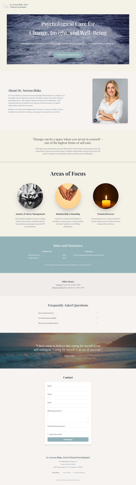

# Dr. Serena Blake, PsyD — Clinical Psychologist Website

A modern, responsive website for Dr. Serena Blake, PsyD, featuring information about services, office hours, contact, and more.

## Features
- React + TypeScript + Vite
- Tailwind CSS for styling
- Modern, accessible UI
- Contact form with validation
- Responsive and mobile-friendly

## Project Structure
```
├── public/
│   ├── favicon.ico
│   ├── ...
├── src/
│   ├── assets/
│   ├── components/
│   ├── pages/
│   └── ...
├── package.json
├── tailwind.config.ts
├── vite.config.ts
└── ...
```

## Getting Started

1. **Install dependencies:**
   ```sh
   npm install
   # or
   bun install
   ```
2. **Start the development server:**
   ```sh
   npm run dev
   # or
   bun run dev
   ```
3. **Build for production:**
   ```sh
   npm run build
   # or
   bun run build
   ```

## Customization
- Update content in `src/components` and `src/pages` as needed.
- Replace images in `src/assets`.
- Adjust styles in `tailwind.config.ts` or `src/index.css`.

## Deployment

The site is live at: [https://therapist-eight.vercel.app/](https://therapist-eight.vercel.app/)


## Preview



## License
This project is for demonstration and informational purposes only.
